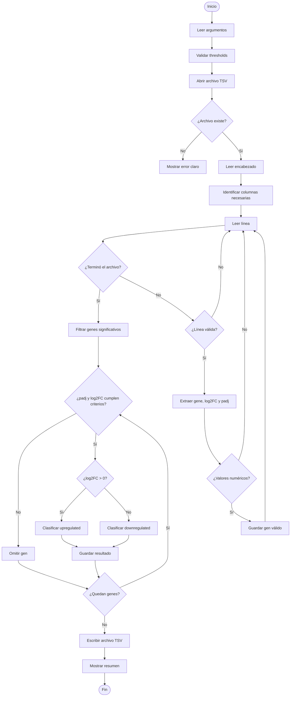

# Diseño del programa

## Idea general

El programa leerá un archivo TSV con resultados de DESeq2. Para cada gen,
extraerá el nombre del gen, el valor de `log2FoldChange` y el valor de `padj`.

Después evaluará si el gen cumple los criterios de significancia:

- `padj < 0.05`
- `abs(log2FoldChange) >= 1`

Si el gen cumple ambos criterios, será clasificado como:

- `upregulated`, si `log2FoldChange > 0`
- `downregulated`, si `log2FoldChange < 0`

Finalmente, el programa guardará los genes significativos en un archivo TSV y
mostrará un resumen en pantalla.

## Entrada del programa

El programa recibirá dos argumentos posicionales:

| Argumento | Descripción |
|---|---|
| `input_file` | Ruta del archivo TSV de entrada |
| `output_file` | Ruta del archivo TSV de salida |

Ejemplo:

```bash
uv run python analyze_iav.py data/iav_deseq2_results.tsv results/iav_significant_genes.tsv
```

## Salida del programa

El archivo de salida tendrá las siguientes columnas:

```text
gene	log2FoldChange	padj	status
```

Ejemplo:

```text
MX1	4.2	0.0001	upregulated
GENE1	-3.0	0.001	downregulated
```

## Estructuras de datos

Para mantener el programa simple y claro, se usará una lista de tuplas.

Cada gen válido leído desde el archivo se representará así:

```python
(gene, log2_fold_change, padj)
```

Ejemplo:

```python
("MX1", 4.2, 0.0001)
```

Cada gen significativo filtrado se representará así:

```python
(gene, log2_fold_change, padj, status)
```

Ejemplo:

```python
("MX1", 4.2, 0.0001, "upregulated")
```

## Algoritmo general

1. Leer argumentos de entrada y salida.
2. Abrir el archivo TSV de entrada.
3. Leer el archivo línea por línea.
4. Ignorar líneas vacías.
5. Identificar el encabezado.
6. Detectar las columnas `gene`, `log2FoldChange` y `padj`.
7. Separar cada línea usando tabuladores.
8. Validar que la línea tenga suficientes columnas.
9. Extraer nombre del gen, `log2FoldChange` y `padj`.
10. Convertir `log2FoldChange` y `padj` a números decimales.
11. Ignorar líneas con valores no numéricos.
12. Guardar los genes válidos en una lista.
13. Recorrer la lista de genes válidos.
14. Evaluar si cada gen cumple `padj < 0.05` y `abs(log2FoldChange) >= 1`.
15. Clasificar genes significativos como `upregulated` o `downregulated`.
16. Guardar los genes significativos en una lista final.
17. Escribir la lista final en un archivo TSV.
18. Mostrar un resumen en pantalla.

## Funciones del programa

| Función | Responsabilidad |
|---|---|
| `parse_arguments()` | Leer argumentos desde la línea de comandos |
| `validate_thresholds()` | Validar thresholds usados por el programa |
| `load_deseq2_results()` | Leer y parsear el archivo TSV |
| `is_significant()` | Evaluar si un gen cumple los criterios de significancia |
| `classify_gene()` | Clasificar un gen como `upregulated` o `downregulated` |
| `filter_genes()` | Filtrar y clasificar genes significativos |
| `write_results()` | Guardar resultados en un archivo TSV |
| `print_summary()` | Mostrar resumen final |
| `main()` | Coordinar todo el flujo del programa |

## Responsabilidad de cada función

### `parse_arguments()`

Lee los argumentos que el usuario escribe en la terminal.

En la versión mínima leerá:

- archivo de entrada
- archivo de salida

En la extensión también leerá:

- `--lfc_threshold`
- `--padj_threshold`

### `validate_thresholds()`

Revisa que los thresholds tengan valores válidos.

Reglas:

- `lfc_threshold` debe ser mayor o igual a 0
- `padj_threshold` debe estar entre 0 y 1

### `load_deseq2_results()`

Lee el archivo TSV de entrada.

Responsabilidades:

- abrir el archivo
- leer encabezado
- encontrar las columnas necesarias
- leer líneas de genes
- ignorar líneas vacías
- ignorar líneas incompletas
- ignorar valores no numéricos
- devolver una lista de genes válidos

Salida esperada:

```python
[
    ("MX1", 4.2, 0.0001),
    ("IFIT1", 5.1, 0.00001),
]
```

### `is_significant()`

Evalúa si un gen cumple los criterios de significancia.

Regla:

```text
padj < padj_threshold and abs(log2_fold_change) >= lfc_threshold
```

Devuelve:

```python
True
```

o:

```python
False
```

### `classify_gene()`

Clasifica la dirección del cambio.

Reglas:

```text
si log2FoldChange > 0 → upregulated
si log2FoldChange < 0 → downregulated
```

### `filter_genes()`

Recibe genes válidos, aplica los criterios de significancia y clasifica los genes
que pasan los filtros.

Salida esperada:

```python
[
    ("MX1", 4.2, 0.0001, "upregulated"),
    ("GENE1", -3.0, 0.001, "downregulated"),
]
```

### `write_results()`

Escribe el archivo TSV final.

Debe incluir encabezado:

```text
gene	log2FoldChange	padj	status
```

### `print_summary()`

Muestra en pantalla:

```text
Genes significativos: X
Genes sobreexpresados: Y
Genes subexpresados: Z
```

### `main()`

Coordina todo el programa.

Su responsabilidad es llamar las funciones en orden:

```text
leer argumentos
validar thresholds
leer archivo
filtrar genes
escribir resultados
mostrar resumen
```

## Diagrama Mermaid



## Decisiones de diseño

1. Se usará un solo archivo Python, `analyze_iav.py`, porque el proyecto mínimo es pequeño.
2. Se separará la lógica en funciones para mejorar claridad y mantenimiento.
3. Se usará `argparse` para manejar argumentos de línea de comandos.
4. Se usarán listas de tuplas para representar genes, porque son suficientes para esta versión.
5. Se ignorarán líneas inválidas para evitar que el programa se rompa por datos incompletos.
6. Se mostrarán mensajes de error claros cuando el archivo de entrada no exista.
7. La integración del archivo GFF no se implementará, porque pertenece a la extensión opcional avanzada.

## Extensión planificada

Después de completar la versión mínima, el programa se extenderá para permitir
configurar thresholds desde la línea de comandos:

```bash
uv run python analyze_iav.py data/iav_deseq2_results.tsv results/iav_significant_genes.tsv --lfc_threshold 2.0 --padj_threshold 0.01
```

Si el usuario no proporciona estos valores, se usarán los valores por defecto:

- `lfc_threshold = 1.0`
- `padj_threshold = 0.05`

---

## Extensión implementada: thresholds configurables

La extensión permite que el usuario cambie los criterios de significancia desde
la línea de comandos.

Antes de la extensión, los valores estaban definidos directamente en el código:

```python
lfc_threshold = 1.0
padj_threshold = 0.05
```

Después de la extensión, estos valores se reciben mediante `argparse`.

## Argumentos nuevos

| Argumento | Tipo | Valor por defecto | Descripción |
|---|---:|---:|---|
| `--lfc_threshold` | float | `1.0` | Magnitud mínima absoluta de `log2FoldChange` |
| `--padj_threshold` | float | `0.05` | Valor máximo permitido de `padj` |

## Ejemplo de ejecución con thresholds personalizados

```bash
uv run python analyze_iav.py data/iav_deseq2_results.tsv results/iav_significant_genes_strict.tsv --lfc_threshold 2.0 --padj_threshold 0.01
```

## Cambios en el diseño

Se agregó la función:

```python
validate_thresholds(args, parser)
```

Esta función valida que:

- `lfc_threshold >= 0`
- `0 <= padj_threshold <= 1`

La función `main()` coordina ahora el flujo completo:

1. Leer argumentos.
2. Validar thresholds.
3. Cargar resultados DESeq2.
4. Filtrar genes usando los thresholds indicados.
5. Escribir resultados.
6. Mostrar resumen.

## Ventaja de la extensión

La principal ventaja es que el programa se vuelve más flexible y reproducible.
El usuario puede ejecutar el mismo análisis con criterios más estrictos o más
permisivos sin editar el archivo `analyze_iav.py`.